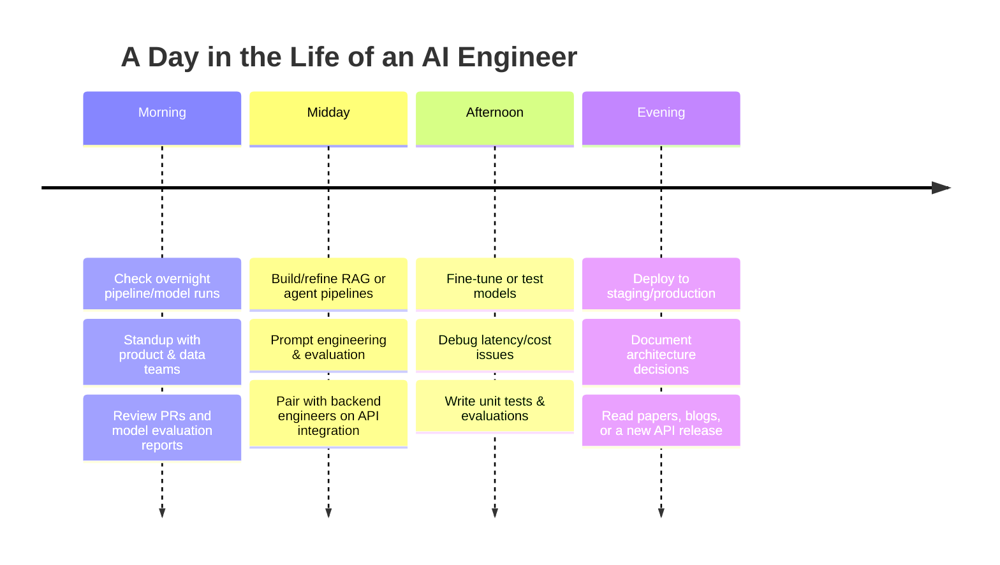

# 🚀 AI Engineer — Career Page

### *AI Career OS — Powered Career Operating System*

---

## 1. Hero Section

# 🤖 AI Engineer

**Design, build, and deploy AI-powered systems — from LLM applications to production ML pipelines — that solve real business problems.**  
AI Engineers sit at the intersection of software engineering and applied AI, turning foundation models, machine learning algorithms, and data pipelines into shipped products. It's one of the fastest-growing, highest-paid tech careers of the decade.


| Attribute                       | Value                                                               |
| ------------------------------- | ------------------------------------------------------------------- |
| 🏷️ **Career Category**         | Software Engineering / Artificial Intelligence                      |
| 📶 **Difficulty Level**         | Intermediate → Advanced                                             |
| ⏱️ **Estimated Learning Time**  | 6–12 months (full-time) / 12–18 months (part-time)                  |
| 💰 **Average Salary (Global)**  | $95,000 – $260,000+ USD                                             |
| 📈 **Hiring Demand**            | 🔥 Very High — #1 fastest-growing job title on LinkedIn (2025–2026) |
| 🌍 **Remote Work Availability** | ★★★★★ Excellent (majority of roles offer hybrid/remote)             |
| 🧠 **AI Compatibility Score**   | 9.8 / 10 — this role *builds* AI, making it highly future-proof     |
| 🎯 **Best For**                 | Analytical thinkers, builders, lifelong learners, problem-solvers   |
| 💻 **Programming Requirement**  | High (Python essential, some JS/TS helpful)                         |
| 📐 **Math Requirement**         | Moderate–High (linear algebra, probability, statistics)             |
| 🎨 **Creativity Level**         | Medium–High (system design, prompt/product design)                  |
| 🗣️ **Communication Level**     | Medium–High (cross-functional collaboration)                        |


> ### ▶️ **[ Start Learning Now → ]**
>
> *Begin Phase 1 of the AI Engineer Roadmap and start building your Career Readiness Score today.*

---

## 2. Career Snapshot


| 📊 Metric                | Status                                                                     |
| ------------------------ | -------------------------------------------------------------------------- |
| **Hiring Demand**        | 🔥🔥🔥🔥🔥 Very High — AI-skill job postings grew ~109% (2024→2026)        |
| **Growth Rate**          | +140% projected role growth through 2030 (LinkedIn Emerging Jobs data)     |
| **Automation Risk**      | 🟢 Very Low — AI Engineers build the automation, low displacement risk     |
| **Remote Opportunities** | 🟢 High — 60–70% of listings offer remote/hybrid                           |
| **AI Usage Level**       | 🟣 Core to the role — daily use of LLMs, copilots, and ML frameworks       |
| **Market Trend**         | 📈 Rising — shift from "ML Engineer" toward "AI/LLM Engineer" hybrid roles |
| **Job Security**         | 🟢 Strong — sustained enterprise investment in AI adoption                 |
| **Future Outlook**       | 🟢 Excellent through 2030+ as AI becomes embedded in every product         |


---

## 3. Career Overview

**What this career is:**
An AI Engineer builds applications and systems powered by artificial intelligence — including large language models (LLMs), computer vision, recommendation systems, and predictive ML models. Unlike a pure ML Researcher, an AI Engineer focuses on **productionizing** AI: integrating APIs (OpenAI, Anthropic, Gemini), fine-tuning models, building retrieval-augmented generation (RAG) pipelines, and deploying scalable, monitored AI services.

**Main responsibilities:**

- Design and build AI-powered features (chatbots, agents, copilots, recommendation engines)
- Integrate LLM APIs and open-source models into production applications
- Build and maintain data pipelines for training/inference
- Fine-tune and evaluate models for accuracy, latency, and cost
- Implement RAG systems with vector databases
- Deploy, monitor, and scale AI services in the cloud
- Collaborate with data scientists, product managers, and backend engineers
- Ensure responsible AI practices (bias testing, guardrails, safety)

**Typical daily work:** Writing Python code, calling/orchestrating LLM APIs, debugging pipelines, reviewing model outputs, running evaluations, deploying to cloud infrastructure, and collaborating in cross-functional standups.

**Industries hiring AI Engineers:** Big Tech, SaaS/startups, finance, healthcare, e-commerce, cybersecurity, gaming, manufacturing, government, consulting.

**Companies that hire:** Google, Microsoft, Amazon, Meta, OpenAI, Anthropic, NVIDIA, Salesforce, Databricks, Scale AI, plus thousands of startups and enterprises building AI-native products (banks, retailers, healthtech, fintech).

**Why this career matters in the AI era:** Every company is becoming an "AI company." AI Engineers are the builders who translate breakthroughs in foundation models into real, usable, revenue-generating products — making this one of the most strategically important and durable roles of the next decade 【Future of AI engineering jobs, trends and skills for growth】.

---

## 4. Is This Career Right For You?

### ✅ Good Fit If…

- You enjoy solving ambiguous, open-ended technical problems
- You like combining software engineering with applied math/statistics
- You're comfortable learning fast — the AI stack changes monthly
- You enjoy experimentation, iteration, and data-driven decision-making
- You want to build products, not just research papers
- You're self-directed and enjoy reading documentation and papers

### ⚠️ Might Not Be Ideal If…

- You dislike constant tooling/framework churn (LangChain, LLM APIs evolve fast)
- You want 100% predictable, routine daily tasks
- You're uncomfortable with math fundamentals (linear algebra, probability)
- You expect to master everything in a few weeks — this field rewards patience
- You dislike debugging non-deterministic systems (LLM outputs vary!)

> 💡 **AI Mentor Tip:** Honest expectation-setting: even senior engineers Google documentation daily. The skill that matters most is **learning velocity**, not memorized knowledge.

---

## 5. A Day in the Life



**Morning:** Sprint planning, standups, reviewing overnight training/inference job results, code review.
**Afternoon:** Core development — building agent workflows, model fine-tuning, testing RAG retrieval quality, integrating APIs.
**Evening:** Deployment, documentation, monitoring dashboards, and dedicated learning time (new model releases, papers, tools).

---

## 6. Career Roadmap

> The heart of AI Career OS. Complete each phase sequentially, unlock milestone badges, and build your Career Readiness Score.

### 🏁 Milestone Track

`First Project` → `First Deployment` → `First Portfolio` → `Open Source Contribution` → `Job Ready`

---

### 📍 Phase 1 — Foundations

**Overview:** Build the programming, math, and computer-science foundation every AI Engineer needs before touching ML frameworks.

**Goal:** Become fluent in Python, core CS concepts, and the math underpinning machine learning.

**Estimated Duration:** 4–6 weeks

**Prerequisites:** None — absolute beginner friendly.

**Learning Goals:**

- Write clean, idiomatic Python (functions, OOP, error handling)
- Understand data structures &amp; algorithms fundamentals
- Grasp linear algebra, probability, and statistics essentials
- Get comfortable with Git/GitHub and the command line

**Topics:**

- Python syntax, data types, control flow, functions, OOP
- NumPy &amp; Pandas for data manipulation
- Linear algebra (vectors, matrices, dot products, eigenvalues)
- Probability &amp; statistics (distributions, Bayes' theorem, hypothesis testing)
- Git version control &amp; terminal basics
- SQL fundamentals

**Courses:**

- ★★★★★ [CS50's Introduction to Programming with Python (Harvard/edX)](https://cs50.harvard.edu/python/)
- ★★★★★ [Python for Everybody (Coursera, Dr. Chuck)](https://www.coursera.org/specializations/python)
- ★★★★ [Mathematics for Machine Learning Specialization (Coursera, Imperial College London)](https://www.coursera.org/specializations/mathematics-machine-learning)

**Documentation:**

- [Python Official Docs](https://docs.python.org/3/)
- [NumPy Documentation](https://numpy.org/doc/)
- [Pandas Documentation](https://pandas.pydata.org/docs/)

**Videos:**

- [freeCodeCamp – Python Full Course](https://www.youtube.com/c/Freecodecamp)
- [3Blue1Brown – Essence of Linear Algebra](https://www.3blue1brown.com/topics/linear-algebra)
- [StatQuest with Josh Starmer (Statistics &amp; ML foundations)](https://www.youtube.com/user/joshstarmer)

**Books:**

- *Python Crash Course* — Eric Matthes
- *Automate the Boring Stuff with Python* — Al Sweigart (free online)
- *Mathematics for Machine Learning* — Deisenroth, Faisal, Ong (free PDF)

**Practical Missions:**

1. Build a command-line expense tracker in Python.
2. Clean and analyze a real dataset (Kaggle) with Pandas.
3. Implement 5 classic algorithms (binary search, sorting, recursion).

**Mini Project:** A Python CLI tool that scrapes a public API, stores results in SQLite, and generates a summary report.

**Resources:**

- [Kaggle Learn (free micro-courses)](https://www.kaggle.com/learn)
- [LeetCode (algorithm practice)](https://leetcode.com/)

> 💡 **AI Mentor Tip:** Use ChatGPT/Claude as a *Socratic tutor* — ask it to explain concepts, then explain them back in your own words before moving on.

**Common Mistakes:**

- Skipping math fundamentals to "get to the fun stuff" too fast
- Not using version control from day one
- Copy-pasting code without understanding it

**Notes:** Foundations feel slow but compound — rushing this phase creates gaps that resurface painfully in Phase 3–4.

**Quiz:** 10-question checkpoint covering Python syntax, NumPy operations, and basic probability (auto-graded in-app).

**Completion Checklist:**

- Comfortable writing Python functions &amp; classes
- Can manipulate data with Pandas/NumPy
- Understand vectors, matrices, and basic probability
- Git repository set up and used for all mini-projects

**Completion Status:** ⬜ Not Started / 🟨 In Progress / ✅ Complete

**Expected Outcome:** You can read/write Python confidently and understand the math vocabulary used in every ML course going forward.

---

### 📍 Phase 2 — Core Skills

**Overview:** Learn classical machine learning and deep learning — the theoretical and practical core of AI engineering.

**Goal:** Train, evaluate, and tune ML/DL models from scratch and using frameworks.

**Estimated Duration:** 8–10 weeks

**Prerequisites:** Phase 1 complete.

**Learning Goals:**

- Understand supervised/unsupervised learning
- Build and train neural networks with PyTorch/TensorFlow
- Understand transformer architecture (the basis of LLMs)
- Learn model evaluation metrics and overfitting/underfitting

**Topics:**

- Regression, classification, clustering
- Feature engineering, cross-validation
- Neural networks, backpropagation, CNNs, RNNs
- Transformers &amp; attention mechanisms
- Introduction to NLP and embeddings
- Model evaluation (precision, recall, F1, ROC-AUC)

**Courses:**

- ★★★★★ [Machine Learning Specialization – Andrew Ng (DeepLearning.AI/Coursera)](https://www.coursera.org/specializations/machine-learning-introduction)
- ★★★★★ [Deep Learning Specialization – Andrew Ng (DeepLearning.AI)](https://www.deeplearning.ai/courses/deep-learning-specialization/)
- ★★★★ [fast.ai – Practical Deep Learning for Coders](https://course.fast.ai/)
- ★★★★ [Hugging Face NLP Course (free)](https://huggingface.co/learn/nlp-course)

**Documentation:**

- [PyTorch Docs](https://pytorch.org/docs/stable/index.html)
- [TensorFlow Docs](https://www.tensorflow.org/api_docs)
- [Scikit-learn Docs](https://scikit-learn.org/stable/)

**Videos:**

- [3Blue1Brown – Neural Networks series](https://www.3blue1brown.com/topics/neural-networks)
- [StatQuest – Neural Networks Clearly Explained](https://www.youtube.com/user/joshstarmer)
- [Andrej Karpathy – Neural Networks: Zero to Hero](https://karpathy.ai/zero-to-hero.html)

**Books:**

- *Hands-On Machine Learning with Scikit-Learn, Keras &amp; TensorFlow* — Aurélien Géron
- *Deep Learning* — Ian Goodfellow, Yoshua Bengio, Aaron Courville (free online)

**Practical Missions:**

1. Build a classification model (e.g., spam detector) with scikit-learn.
2. Train a CNN for image classification on CIFAR-10.
3. Fine-tune a small transformer model on a text classification task using Hugging Face.

**Mini Project:** An end-to-end ML pipeline: data cleaning → feature engineering → model training → evaluation report, tracked with MLflow or Weights &amp; Biases.

**Resources:**

- [Kaggle Competitions](https://www.kaggle.com/competitions)
- [Papers with Code](https://paperswithcode.com/)

> 💡 **AI Mentor Tip:** Don't just run tutorials — break them. Change hyperparameters, swap datasets, and observe *why* results change. That's where real understanding is built.

**Common Mistakes:**

- Treating deep learning as a black box without understanding the math
- Ignoring data quality (garbage in, garbage out)
- Overfitting to a single dataset/benchmark and not validating properly

**Notes:** This is the most math/theory-heavy phase — budget extra time here if you're newer to statistics.

**Quiz:** 15-question checkpoint on ML algorithms, transformer basics, and evaluation metrics.

**Completion Checklist:**

- Trained at least 3 different model types
- Understand transformer/attention fundamentals
- Comfortable with PyTorch or TensorFlow basics
- Can evaluate model performance correctly

**Completion Status:** ⬜ Not Started / 🟨 In Progress / ✅ Complete

**Expected Outcome:** You can build, train, and evaluate ML/DL models independently and understand how modern LLMs work under the hood.

---

### 📍 Phase 3 — Professional Tools

**Overview:** Learn the modern AI engineering stack — LLM APIs, orchestration frameworks, vector databases, and cloud AI platforms used in real jobs.

**Goal:** Become production-capable with the tools companies actually use to ship AI features.

**Estimated Duration:** 6–8 weeks

**Prerequisites:** Phase 2 complete.

**Learning Goals:**

- Call and orchestrate LLM APIs (OpenAI, Anthropic, Gemini)
- Build RAG pipelines with vector databases
- Use LangChain/LlamaIndex for agent workflows
- Deploy models/APIs to the cloud

**Topics:**

- Prompt engineering &amp; prompt evaluation
- Retrieval-Augmented Generation (RAG)
- Vector embeddings &amp; vector databases
- Agentic workflows &amp; tool-calling
- Fine-tuning vs. prompting vs. RAG decision-making
- Cloud AI services (AWS Bedrock, Azure AI, Vertex AI)
- Containerization (Docker) &amp; basic Kubernetes

**Courses:**

- ★★★★★ [ChatGPT Prompt Engineering for Developers (DeepLearning.AI, free)](https://www.deeplearning.ai/short-courses/chatgpt-prompt-engineering-for-developers/)
- ★★★★★ [LangChain for LLM Application Development (DeepLearning.AI)](https://www.deeplearning.ai/short-courses/langchain-for-llm-application-development/)
- ★★★★ [Building Systems with the ChatGPT API (DeepLearning.AI)](https://www.deeplearning.ai/short-courses/building-systems-with-chatgpt/)
- ★★★★ [AWS Machine Learning Engineer Nanodegree (Udacity)](https://www.udacity.com/)

**Documentation:**

- [OpenAI API Docs](https://platform.openai.com/docs)
- [Anthropic API Docs](https://docs.anthropic.com/)
- [LangChain Docs](https://python.langchain.com/)
- [Pinecone / Chroma / Weaviate Docs](https://docs.pinecone.io/)

**Videos:**

- [Andrej Karpathy – "Let's build the GPT Tokenizer" / "Intro to Large Language Models"](https://www.youtube.com/@AndrejKarpathy)
- [LangChain Official YouTube Tutorials](https://www.youtube.com/@LangChain)

**Books:**

- *Designing Machine Learning Systems* — Chip Huyen
- *Building LLM Apps* — Valentina Alto

**Practical Missions:**

1. Build a RAG chatbot over your own PDF/document collection using LangChain + a vector DB.
2. Build a tool-calling agent that queries a live API (weather, search, database).
3. Deploy an LLM-powered API endpoint with FastAPI + Docker on a cloud provider.

**Mini Project:** A "Chat with your documents" app: upload PDFs, embed them, store in a vector database, and answer questions with citations.

**Resources:**

- [Hugging Face Hub](https://huggingface.co/models)
- [LangChain Templates/Cookbook](https://github.com/langchain-ai/langchain)

> 💡 **AI Mentor Tip:** Learn to *evaluate* AI outputs systematically (using frameworks like RAGAS or promptfoo) — "vibes-based" testing is the #1 sign of a junior AI engineer.

**Common Mistakes:**

- Over-engineering with agents when a simple prompt/RAG pipeline would suffice
- Ignoring cost and latency tradeoffs of different models
- Not implementing evaluation/guardrails before shipping

**Notes:** This stack evolves monthly — focus on transferable *concepts* (retrieval, embeddings, orchestration) over any single library's syntax.

**Quiz:** 15-question checkpoint on RAG architecture, prompt engineering, and API integration.

**Completion Checklist:**

- Built and deployed a RAG application
- Comfortable with at least 2 LLM provider APIs
- Used a vector database in a real project
- Containerized an application with Docker

**Completion Status:** ⬜ Not Started / 🟨 In Progress / ✅ Complete

**Expected Outcome:** You can build and deploy production-style LLM applications using the current industry-standard toolchain.

---

### 📍 Phase 4 — Real Projects

**Overview:** Apply everything in multi-week, realistic projects that mirror actual workplace assignments.

**Goal:** Practice end-to-end delivery: requirements → build → test → deploy → monitor.

**Estimated Duration:** 6–8 weeks

**Prerequisites:** Phases 1–3 complete.

**Learning Goals:**

- Scope and plan an AI feature like a product owner would
- Handle real-world messy data
- Implement monitoring/observability for AI systems
- Practice collaborative workflows (PRs, code review, CI/CD)

**Topics:**

- MLOps fundamentals (CI/CD for ML, model versioning)
- Monitoring &amp; observability (drift detection, logging, alerting)
- A/B testing AI features
- Cost optimization for LLM applications
- Security &amp; responsible AI (PII handling, jailbreak defense)

**Courses:**

- ★★★★★ [MLOps Specialization (DeepLearning.AI)](https://www.deeplearning.ai/courses/machine-learning-engineering-for-production-mlops/)
- ★★★★ [Full Stack Deep Learning (free, fullstackdeeplearning.com)](https://fullstackdeeplearning.com/)

**Documentation:**

- [MLflow Docs](https://mlflow.org/docs/latest/index.html)
- [Weights &amp; Biases Docs](https://docs.wandb.ai/)
- [Docker Docs](https://docs.docker.com/)

**Videos:**

- [Full Stack Deep Learning YouTube Lectures](https://www.youtube.com/@FullStackDeepLearning)

**Books:**

- *Designing Data-Intensive Applications* — Martin Kleppmann (systems thinking)
- *Machine Learning Design Patterns* — Lakshmanan, Robinson, Munn

**Practical Missions:**

1. Add CI/CD (GitHub Actions) to an existing AI project with automated tests.
2. Implement logging + a monitoring dashboard for an LLM app (track latency, cost, errors).
3. Contribute a real fix or feature to an open-source AI project (LangChain, LlamaIndex, etc.).

**Mini Project:** A production-grade AI feature (e.g., an AI customer-support agent) with tests, CI/CD, monitoring, and a rollback strategy.

**Resources:**

- [Made With ML (MLOps best practices, free)](https://madewithml.com/)
- [Awesome MLOps (GitHub list)](https://github.com/visenger/awesome-mlops)

> 💡 **AI Mentor Tip:** Recruiters and interviewers care far more about "Did you monitor and iterate on this in production?" than "Did you use the newest model?" — show operational maturity.

**Common Mistakes:**

- Building projects that never leave a Jupyter notebook
- No tests, no CI/CD, no monitoring — "it works on my machine"
- Ignoring edge cases and failure modes of AI outputs

**Notes:** This phase is where you start thinking and working like a professional engineer, not a student.

**Quiz:** Scenario-based assessment: debug a broken CI/CD pipeline and diagnose a model drift alert.

**Completion Checklist:**

- Shipped a project with CI/CD
- Implemented monitoring/logging for an AI system
- Made at least 1 open-source contribution
- Documented architecture decisions clearly

**Completion Status:** ⬜ Not Started / 🟨 In Progress / ✅ Complete

**Expected Outcome:** You can take an AI feature from prototype to a monitored, tested production system — the core differentiator of a hireable AI Engineer.

---

### 📍 Phase 5 — Portfolio

**Overview:** Package your best work into a compelling, employer-ready portfolio.

**Goal:** Build 3–5 polished, documented projects that demonstrate range and production skill.

**Estimated Duration:** 3–4 weeks

**Prerequisites:** Phase 4 complete.

**Learning Goals:**

- Write clear technical documentation and READMEs
- Present projects with business impact framing
- Build a personal portfolio site
- Optimize GitHub profile for recruiter visibility

**Topics:**

- Technical writing &amp; storytelling
- Portfolio website design (or use Notion/GitHub Pages)
- Demo video creation (Loom)
- Metrics &amp; impact framing ("reduced latency by 40%")

**Courses:**

- ★★★★ [Google Technical Writing Courses (free)](https://developers.google.com/tech-writing)
- ★★★ [Build a Portfolio Website (freeCodeCamp)](https://www.freecodecamp.org/)

**Documentation:**

- [GitHub Docs – About READMEs](https://docs.github.com/en/repositories/managing-your-repositorys-settings-and-features/customizing-your-repository/about-readmes)

**Videos:**

- [How to Build an ML/AI Portfolio (YouTube – various creators: Krish Naik, StatQuest, freeCodeCamp)](https://www.youtube.com/)

**Books:**

- *The Pragmatic Programmer* — Hunt &amp; Thomas (professional craftsmanship mindset)

**Practical Missions:**

1. Write a polished README with architecture diagram for each top project.
2. Record a 2-minute Loom demo video per project.
3. Publish a portfolio site (GitHub Pages, Vercel, or Notion) linking all projects.

**Mini Project:** A personal portfolio site showcasing 3–5 projects, each with live demo links, GitHub repos, and short case-study write-ups.

**Resources:**

- [Vercel (free hosting)](https://vercel.com/)
- [Notion (portfolio alternative)](https://www.notion.so/)

> 💡 **AI Mentor Tip:** Quality beats quantity — 3 deep, well-documented projects outperform 10 shallow tutorials on your GitHub.

**Common Mistakes:**

- No README or setup instructions on GitHub repos
- Projects with no live demo or screenshots
- Describing *what* you built but not *why it matters*

**Notes:** Treat your portfolio like a product — your target user is a hiring manager scanning for 90 seconds.

**Quiz:** Peer/AI-reviewed portfolio audit checklist (auto-scored).

**Completion Checklist:**

- 3–5 polished portfolio projects published
- Each project has README, live demo, and case study
- Personal portfolio site live
- GitHub profile fully optimized

**Completion Status:** ⬜ Not Started / 🟨 In Progress / ✅ Complete

**Expected Outcome:** A recruiter-ready portfolio that clearly demonstrates production AI engineering capability.

---

### 📍 Phase 6 — Job Preparation

**Overview:** Prepare for and execute your job search — resume, LinkedIn, interviews, and negotiation.

**Goal:** Land interviews and convert them into offers.

**Estimated Duration:** 3–6 weeks (parallel with active applications)

**Prerequisites:** Phase 5 complete.

**Learning Goals:**

- Craft an ATS-optimized resume
- Optimize LinkedIn for recruiter discovery
- Practice technical and behavioral interviews
- Negotiate salary confidently

**Topics:**

- Resume writing &amp; ATS optimization
- LinkedIn branding &amp; networking
- Coding interviews (DSA) + ML system design
- Take-home assignments &amp; whiteboard exercises
- Behavioral interviews (STAR method)
- Salary negotiation tactics

**Courses:**

- ★★★★★ [Grokking the Machine Learning Interview (Educative)](https://www.educative.io/courses/grokking-the-machine-learning-interview)
- ★★★★ [Cracking the Coding Interview practice via NeetCode](https://neetcode.io/)

**Documentation:**

- [Google's ML System Design Guide (free)](https://developers.google.com/machine-learning/guides)

**Videos:**

- [NeetCode – Coding Interview Prep](https://www.youtube.com/c/NeetCode)
- [Exponent – ML/AI Interview Prep](https://www.youtube.com/@tryexponent)

**Books:**

- *Cracking the Coding Interview* — Gayle Laakmann McDowell
- *Cracking the PM/ML Interview* resources — various

**Practical Missions:**

1. Complete 3 full mock interviews (technical + behavioral).
2. Rewrite your resume using metrics-driven bullet points.
3. Publish 2 LinkedIn posts about your portfolio projects.

**Mini Project:** A mock "job application sprint": apply to 20 targeted roles with tailored resumes/cover letters in one week.

**Resources:**

- [Pramp (free mock interviews)](https://www.pramp.com/)
- [Levels.fyi (salary benchmarking)](https://www.levels.fyi/)

> 💡 **AI Mentor Tip:** Use ChatGPT/Claude to simulate interviewer personas and generate custom behavioral questions based on your resume — then practice out loud, not just mentally.

**Common Mistakes:**

- Generic, unquantified resume bullet points
- Not practicing system design / ML design questions
- Accepting the first offer without negotiating
- Inactive or incomplete LinkedIn profile

**Notes:** Job searching is itself a skill — track applications, response rates, and iterate weekly.

**Quiz:** Full mock interview simulation with scored feedback (technical + behavioral).

**Completion Checklist:**

- ATS-optimized resume finalized
- LinkedIn fully optimized with active posting
- 3+ mock interviews completed
- Applied to 20+ targeted roles

**Completion Status:** ⬜ Not Started / 🟨 In Progress / ✅ Complete

**Expected Outcome:** You are fully job-ready with a polished application package and interview confidence.

---

## 7. Skills Required

### 💻 Technical Skills


| Skill                              | Importance | Difficulty  | Industry Usage      | Progress   |
| ---------------------------------- | ---------- | ----------- | ------------------- | ---------- |
| Python Programming                 | ★★★★★      | Medium      | Universal           | ▓▓▓▓▓▓▓▓▓▓ |
| Linear Algebra &amp; Statistics    | ★★★★★      | Medium-High | Foundational        | ▓▓▓▓▓▓▓░░░ |
| Machine Learning (scikit-learn)    | ★★★★★      | Medium-High | Very High           | ▓▓▓▓▓▓░░░░ |
| Deep Learning (PyTorch/TensorFlow) | ★★★★★      | High        | Very High           | ▓▓▓▓▓░░░░░ |
| LLM APIs &amp; Prompt Engineering  | ★★★★★      | Medium      | Very High (growing) | ▓▓▓▓▓▓▓░░░ |
| RAG &amp; Vector Databases         | ★★★★★      | Medium-High | Very High (growing) | ▓▓▓▓▓░░░░░ |
| LangChain/LlamaIndex               | ★★★★       | Medium      | High                | ▓▓▓▓░░░░░░ |
| Cloud Platforms (AWS/Azure/GCP)    | ★★★★       | Medium-High | High                | ▓▓▓▓░░░░░░ |
| Docker &amp; Kubernetes            | ★★★★       | Medium      | High                | ▓▓▓░░░░░░░ |
| MLOps &amp; CI/CD                  | ★★★★       | High        | High                | ▓▓▓░░░░░░░ |
| SQL &amp; Data Engineering         | ★★★★       | Medium      | Universal           | ▓▓▓▓▓▓░░░░ |
| System Design                      | ★★★★       | High        | High (senior+)      | ▓▓░░░░░░░░ |


### 🤝 Soft Skills


| Skill                              | Importance | Difficulty  | Industry Usage  | Progress   |
| ---------------------------------- | ---------- | ----------- | --------------- | ---------- |
| Communication &amp; Documentation  | ★★★★★      | Medium      | Universal       | ▓▓▓▓▓▓░░░░ |
| Cross-functional Collaboration     | ★★★★★      | Medium      | Universal       | ▓▓▓▓▓░░░░░ |
| Problem Decomposition              | ★★★★★      | Medium-High | Universal       | ▓▓▓▓▓░░░░░ |
| Adaptability / Continuous Learning | ★★★★★      | Medium      | Critical in AI  | ▓▓▓▓▓▓░░░░ |
| Business/Product Thinking          | ★★★★       | Medium      | High            | ▓▓▓░░░░░░░ |
| Ethical Judgment (Responsible AI)  | ★★★★       | Medium      | Growing rapidly | ▓▓▓░░░░░░░ |


---

## 8. Tools &amp; Software

### 🖥️ IDEs

- **VS Code** — industry-standard, extensible, great Python/Jupyter support. Use daily for all development.
- **Cursor** — AI-native IDE built for pair-programming with AI. Use when you want deep AI-assisted refactoring.
- **JupyterLab** — best for exploratory data analysis and experimentation.

### 💬 Programming Languages

- **Python** — the primary language of AI/ML; use for everything from data processing to model deployment.
- **SQL** — essential for querying/joining data; use daily for data access.
- **JavaScript/TypeScript** — useful for building front-end interfaces for AI apps.

### 🧩 Frameworks

- **PyTorch** — the dominant deep learning framework in research and industry; use for training/fine-tuning models.
- **TensorFlow/Keras** — still common in enterprise production pipelines.
- **LangChain / LlamaIndex** — orchestration frameworks for LLM apps; use when building RAG pipelines and agents.
- **FastAPI** — for building performant AI model API endpoints.

### 🤖 AI Coding Assistants

- **GitHub Copilot** — inline code completion; use for boilerplate and speeding up routine coding.
- **Cursor** — full AI-native coding workflow; use for larger refactors and multi-file edits.

### 🧠 LLM Providers

- **OpenAI (GPT models)** — use for general-purpose reasoning, coding, and chat applications.
- **Anthropic (Claude models)** — use for long-context, safety-focused, and agentic tasks.
- **Google Gemini** — use for multimodal (text+image+video) applications and tight Google Cloud integration.

### ☁️ AI Platforms

- **Hugging Face** — hosting, fine-tuning, and sharing open-source models; use for finding and deploying open models.
- **Azure AI Foundry** — enterprise LLM deployment and governance.
- **Google AI Studio / Vertex AI** — prototyping and production Gemini-based apps.

### 🗄️ Vector Databases

- **Pinecone** — managed, scalable vector search; use for production RAG at scale.
- **Chroma** — lightweight, open-source, great for prototyping RAG locally.
- **Weaviate / Qdrant** — open-source, self-hostable, good for enterprise control.

### 🔌 APIs

- **OpenAI API, Anthropic API, Google Gemini API** — core building blocks for LLM features.
- **Serper/Tavily (search APIs)** — for giving agents real-time web access.

### ☁️ Cloud Services

- **AWS (SageMaker, Bedrock, EC2/Lambda)** — most widely used in enterprise; use for scalable training/deployment.
- **Google Cloud (Vertex AI)** — strong for Gemini-native and BigQuery-integrated workflows.
- **Microsoft Azure (Azure AI, Azure ML)** — dominant in enterprise/Fortune 500 environments.

### ⚙️ MLOps

- **MLflow** — experiment tracking and model registry.
- **Weights &amp; Biases** — experiment tracking, visualization, and collaboration.
- **DVC** — data/model version control.

### 🚀 Deployment

- **Docker** — containerize AI applications for consistent deployment.
- **Kubernetes** — orchestrate containers at scale (learn basics; deep expertise is often a separate DevOps role).
- **Vercel / Render / Railway** — fast deployment for smaller AI web apps and demos.

### 📈 Monitoring

- **Grafana + Prometheus** — infrastructure and application monitoring.
- **Arize AI / WhyLabs** — ML-specific observability (drift, data quality).
- **LangSmith** — tracing and evaluation for LLM applications.

### 🗂️ Productivity

- **Notion** — documentation, project planning, second brain.
- **Linear/Jira** — sprint and task management.

### 🤝 Collaboration

- **Slack** — team communication.
- **GitHub** — code collaboration, PR review, issue tracking.
- **Figma** — for reviewing/collaborating on AI product UX.

---

## 9. Learning Resources

### 🎓 Free Courses

- ★★★★★ [Machine Learning Specialization – Andrew Ng](https://www.coursera.org/specializations/machine-learning-introduction)
- ★★★★★ [Hugging Face NLP Course](https://huggingface.co/learn/nlp-course)
- ★★★★★ [Google Machine Learning Crash Course](https://developers.google.com/machine-learning/crash-course)
- ★★★★ [fast.ai – Practical Deep Learning for Coders](https://course.fast.ai/)

### 💳 Paid Courses

- ★★★★★ [Deep Learning Specialization – DeepLearning.AI](https://www.deeplearning.ai/courses/deep-learning-specialization/)
- ★★★★ [Grokking the Machine Learning Interview – Educative](https://www.educative.io/courses/grokking-the-machine-learning-interview)
- ★★★★ [AI/ML Nanodegrees – Udacity](https://www.udacity.com/)

### 📄 Documentation

- ★★★★★ [PyTorch Docs](https://pytorch.org/docs/stable/)
- ★★★★★ [OpenAI API Docs](https://platform.openai.com/docs)
- ★★★★★ [Anthropic API Docs](https://docs.anthropic.com/)
- ★★★★ [LangChain Docs](https://python.langchain.com/)

### 📚 Books

- ★★★★★ *Hands-On Machine Learning* — Aurélien Géron
- ★★★★★ *Designing Machine Learning Systems* — Chip Huyen
- ★★★★ *Deep Learning* — Goodfellow, Bengio, Courville
- ★★★★ *Building LLM Apps* — Valentina Alto

### 📺 YouTube Channels

- ★★★★★ [Andrej Karpathy](https://www.youtube.com/@AndrejKarpathy)
- ★★★★★ [StatQuest with Josh Starmer](https://www.youtube.com/user/joshstarmer)
- ★★★★ [3Blue1Brown](https://www.youtube.com/c/3blue1brown)
- ★★★★ [Two Minute Papers](https://www.youtube.com/@TwoMinutePapers)

### ✍️ Blogs

- ★★★★★ [Hugging Face Blog](https://huggingface.co/blog)
- ★★★★★ [OpenAI Blog](https://openai.com/blog)
- ★★★★ [Chip Huyen's Blog](https://huyenchip.com/blog/)
- ★★★★ [Lilian Weng's Blog](https://lilianweng.github.io/)

### 📬 Newsletters

- ★★★★★ [The Batch (DeepLearning.AI)](https://www.deeplearning.ai/the-batch/)
- ★★★★ [Import AI](https://importai.substack.com/)
- ★★★★ [Ben's Bites](https://www.bensbites.com/)

### 🎙️ Podcasts

- ★★★★ [Latent Space](https://www.latent.space/)
- ★★★★ [Practical AI](https://changelog.com/practicalai)
- ★★★ [The TWIML AI Podcast](https://twimlai.com/podcast/twimlai/)

### 👥 Communities

- ★★★★★ [Hugging Face Discord](https://huggingface.co/join/discord)
- ★★★★ [r/MachineLearning (Reddit)](https://www.reddit.com/r/MachineLearning/)
- ★★★★ [MLOps Community Slack](https://mlops.community/)

### 🏆 Certifications

- ★★★★★ [AWS Certified Machine Learning – Specialty](https://aws.amazon.com/certification/certified-machine-learning-specialty/)
- ★★★★★ [Microsoft Certified: Azure AI Engineer Associate](https://learn.microsoft.com/en-us/certifications/azure-ai-engineer/)
- ★★★★ [Google Cloud Professional Machine Learning Engineer](https://cloud.google.com/certification/machine-learning-engineer)
- ★★★★ [DeepLearning.AI TensorFlow Developer Certificate](https://www.deeplearning.ai/courses/tensorflow-developer-professional-certificate/)

---

## 10. Hands-on Missions

### 🟢 Beginner

1. **Objective:** Build a Python data-cleaning script | **Difficulty:** Easy | **Time:** 3–5 hrs | **Deliverables:** Cleaned dataset + script | **Review Checklist:** Handles nulls, correct data types, documented code
2. **Objective:** Train a scikit-learn classifier | **Difficulty:** Easy | **Time:** 4–6 hrs | **Deliverables:** Jupyter notebook with metrics | **Review Checklist:** Train/test split, evaluation metrics reported

### 🟡 Intermediate

3. **Objective:** Build a RAG chatbot over your own documents | **Difficulty:** Medium | **Time:** 10–15 hrs | **Deliverables:** Working app + repo | **Review Checklist:** Correct retrieval, citations, error handling
4. **Objective:** Fine-tune a small open-source LLM | **Difficulty:** Medium | **Time:** 10–15 hrs | **Deliverables:** Fine-tuned model + eval report | **Review Checklist:** Clear before/after metrics

### 🔴 Advanced

5. **Objective:** Build a multi-tool AI agent (search + calculator + database) | **Difficulty:** Hard | **Time:** 20–25 hrs | **Deliverables:** Deployed agent app | **Review Checklist:** Handles tool failures gracefully, logs decisions
6. **Objective:** Implement CI/CD + monitoring for an AI app | **Difficulty:** Hard | **Time:** 15–20 hrs | **Deliverables:** Deployed pipeline with dashboards | **Review Checklist:** Automated tests, alerting configured

### ⚫ Expert

7. **Objective:** Build a production-grade multi-agent system with guardrails | **Difficulty:** Expert | **Time:** 30–40 hrs | **Deliverables:** Full architecture doc + deployed system | **Review Checklist:** Safety guardrails, cost controls, scalability tested

### 🏆 Capstone

8. **Objective:** End-to-end AI SaaS product (auth, billing-ready, AI feature, monitoring, deployed) | **Difficulty:** Capstone | **Time:** 40–60 hrs | **Deliverables:** Live product + demo video + case study | **Review Checklist:** Production-quality code, documentation, real user testing

---

## 11. Portfolio Projects

### Project 1 — "DocuChat" RAG Assistant

- **Description:** A chatbot that answers questions from uploaded PDFs with cited sources.
- **Technologies:** Python, LangChain, Chroma/Pinecone, OpenAI API, Streamlit
- **Difficulty:** Intermediate
- **Estimated Time:** 15–20 hours
- **Skills Learned:** RAG architecture, embeddings, prompt engineering
- **Portfolio Value:** ★★★★★
- **Employer Appeal:** High — directly maps to real enterprise use cases (internal knowledge bots)

### Project 2 — AI-Powered Customer Support Agent

- **Description:** An agent that resolves support tickets using tools (order lookup, refund API) with escalation logic.
- **Technologies:** Python, LangChain/LlamaIndex, FastAPI, PostgreSQL
- **Difficulty:** Advanced
- **Estimated Time:** 25–30 hours
- **Skills Learned:** Agentic workflows, tool-calling, guardrails
- **Portfolio Value:** ★★★★★
- **Employer Appeal:** Very High — agents are the top hiring trend in 2026

### Project 3 — Computer Vision Quality Inspector

- **Description:** A CNN-based image classifier that detects defects in product photos.
- **Technologies:** PyTorch, OpenCV, FastAPI, Docker
- **Difficulty:** Intermediate
- **Estimated Time:** 15–20 hours
- **Skills Learned:** CNNs, model deployment, image preprocessing
- **Portfolio Value:** ★★★★
- **Employer Appeal:** High — relevant to manufacturing/retail

### Project 4 — Fine-Tuned Domain LLM

- **Description:** Fine-tune an open-source LLM (e.g., Llama/Mistral) on a niche dataset (legal, medical, or coding).
- **Technologies:** Hugging Face Transformers, LoRA/PEFT, W&amp;B
- **Difficulty:** Advanced
- **Estimated Time:** 20–25 hours
- **Skills Learned:** Fine-tuning, evaluation, cost/performance tradeoffs
- **Portfolio Value:** ★★★★★
- **Employer Appeal:** Very High — demonstrates deep technical depth

### Project 5 — MLOps Monitoring Dashboard

- **Description:** A dashboard tracking model drift, latency, and cost for a deployed ML/LLM service.
- **Technologies:** MLflow, Grafana, Prometheus, Python
- **Difficulty:** Advanced
- **Estimated Time:** 15–20 hours
- **Skills Learned:** Observability, MLOps, production maturity
- **Portfolio Value:** ★★★★
- **Employer Appeal:** High — shows operational engineering maturity

---

## 12. Certifications


| Certification                               | Provider            | Difficulty  | Cost    | Duration      | Industry Recognition | Importance  | Recommended Timing |
| ------------------------------------------- | ------------------- | ----------- | ------- | ------------- | -------------------- | ----------- | ------------------ |
| AWS Certified Machine Learning – Specialty  | Amazon Web Services | High        | ~$300   | 6–10 wks prep | ★★★★★                | High        | After Phase 3      |
| Microsoft Azure AI Engineer Associate       | Microsoft           | Medium-High | ~$165   | 4–8 wks prep  | ★★★★★                | High        | After Phase 3      |
| Google Cloud Professional ML Engineer       | Google Cloud        | High        | ~$200   | 6–10 wks prep | ★★★★★                | High        | After Phase 4      |
| DeepLearning.AI TensorFlow Developer Cert   | DeepLearning.AI     | Medium      | ~$50/mo | 4–6 wks       | ★★★★                 | Medium      | After Phase 2      |
| Databricks Generative AI Engineer Associate | Databricks          | Medium      | ~$200   | 4–6 wks       | ★★★★                 | Medium-High | After Phase 3      |


> 💡 **AI Mentor Tip:** Certifications supplement — they never replace — a strong project portfolio. Prioritize one cloud certification aligned with your target employers' stack.

---

## 13. AI Tools Used in This Career

- **ChatGPT** — daily coding assistant, debugging partner, and rapid prototyping tool for prompts and logic.
- **Claude** — excellent for long-context document analysis, code review, and agentic reasoning tasks.
- **Gemini** — strong for multimodal tasks (image/video + text) and native Google Cloud integrations.
- **GitHub Copilot** — inline autocomplete for boilerplate, tests, and repetitive code patterns.
- **Cursor** — AI-native IDE for larger refactors, multi-file edits, and codebase-aware assistance.
- **Perplexity** — fast, cited research for staying current on papers, tools, and benchmarks.
- **OpenAI API** — the backbone for building GPT-powered features and function/tool calling.
- **Anthropic API** — used for Claude-powered agents, long-document processing, and safety-critical apps.
- **Google AI Studio** — rapid prototyping with Gemini models before productionizing on Vertex AI.
- **Azure AI** — enterprise-grade LLM deployment, content safety, and governance tooling.
- **Hugging Face** — hosting, discovering, and fine-tuning open-source models; the "GitHub of ML models."

---

## 14. Career Progression

```
Previous Careers
   Software Engineer / Data Analyst / Backend Developer / Data Scientist
        ↓
Current Career
   AI Engineer
        ↓
Advanced Careers
   Senior AI Engineer → Lead AI Engineer → AI/ML Architect → Principal AI Engineer → Head of AI / VP of AI Engineering
```

**Possible Transitions:**

- **Lateral:** ML Engineer, Data Scientist, MLOps Engineer, AI Product Manager
- **Upward:** AI Solutions Architect, Head of AI, CTO (at AI-native startups)
- **Specialization Paths:** LLM/Agent Specialist, Computer Vision Engineer, NLP Engineer, Applied Research Scientist

---

## 15. Salary &amp; Job Market

> Figures reflect 2026 market data aggregated from industry salary reports (base salary, USD/local currency equivalents). Actual compensation varies by company stage, location, and total comp structure (equity/bonus) 【AI Engineer Salary 2026: $145K–$310K (Real Offer Data)】【AI Engineer Salary Trends 2026: Complete Market Analysis | Zen van Riel】.


| Level     | USA (USD)    | Europe Avg (EUR) | Germany (EUR) | UK (GBP)    | Canada (CAD) | Australia (AUD) |
| --------- | ------------ | ---------------- | ------------- | ----------- | ------------ | --------------- |
| Junior    | $95K–$140K   | €45K–€60K        | €55K–€70K     | £40K–£55K   | $75K–$95K    | $90K–$110K      |
| Mid       | $130K–$190K  | €65K–€90K        | €75K–€95K     | £60K–£80K   | $100K–$130K  | $120K–$150K     |
| Senior    | $180K–$260K  | €90K–€120K       | €95K–€120K    | £80K–£110K  | $130K–$170K  | $150K–$190K     |
| Lead      | $230K–$320K  | €110K–€140K      | €115K–€140K   | £100K–£130K | $160K–$200K  | $180K–$220K     |
| Principal | $300K–$450K+ | €130K–€170K      | €135K–€160K   | £120K–£150K | $190K–$240K  | $210K–$260K     |


**Remote:** US-based remote roles often match or slightly discount in-office US ranges; globally remote roles for non-US-based engineers typically pay $60K–$150K depending on region and employer location policy.
**Freelance:** $50–$180/hour depending on specialization (RAG/agent building and fine-tuning command premium rates).

**Hiring Trend:** AI Engineer has become the #1 fastest-growing job title on LinkedIn, with AI-skill job postings growing roughly 109% from 2024 to 2026 【Demand for AI Engineers in 2026 and Beyond: Market Trends, Skills &amp; Opportunities】【State of the software engineering job market in 2026】.

**Market Demand:** Sustained strong demand concentrated in candidates with 2–6 years of experience, though entry-level opportunities exist for candidates with strong portfolios 【AI Engineer Job Outlook 2026: Trends, Salaries, and Skills – 365 Data Science】.

**Future Outlook:** Continued strong growth through 2030 as AI adoption deepens across every industry vertical; roles are increasingly shifting from "ML Engineer" toward hybrid "AI/LLM/Agent Engineer" titles.

---

## 16. Daily Workflow

```mermaid
timeline
    title Typical AI Engineer Workday
    09:00 : Standup & pipeline health check
    10:00 : Deep work - model/agent development
    12:00 : Lunch break
    13:00 : Cross-functional collaboration (product/data)
    14:30 : Testing, evaluation, debugging
    16:00 : Code review & deployment
    17:00 : Documentation & learning time
```

---

## 17. Real-World Use Cases

- **Startups:** Building AI-native MVPs (AI copilots, chat assistants) to compete quickly in crowded markets.
- **Enterprise:** Internal knowledge-base chatbots, employee copilots, and workflow automation at scale.
- **Healthcare:** Clinical documentation assistants, medical imaging analysis, patient triage chatbots.
- **Finance:** Fraud detection models, algorithmic trading signals, AI-powered financial advisors/chatbots.
- **Retail:** Personalized recommendation engines, visual search, dynamic pricing models.
- **Manufacturing:** Computer vision for defect detection, predictive maintenance models.
- **Government:** Document processing automation, citizen service chatbots, fraud/anomaly detection.
- **Education:** Personalized tutoring systems, automated grading, content generation tools.
- **Agencies:** Building custom AI solutions for multiple clients (chatbots, content generation, automation).
- **Consulting:** AI strategy and implementation for enterprises adopting AI transformation initiatives.
- **Freelancing:** Building custom RAG/chatbot solutions for SMBs on platforms like Upwork/Toptal.

---

## 18. Job Preparation Workspace

### 📄 Resume Checklist

- One page, ATS-friendly format (no tables/graphics in body)
- Quantified achievements ("reduced inference latency by 35%")
- Skills section matches target job description keywords
- Top 3 projects linked with GitHub/live demo URLs
- Reverse-chronological, consistent formatting

### 🔗 LinkedIn Checklist

- Professional headshot + AI-relevant headline
- "Open to Work" enabled (if actively searching)
- Featured section showcasing top projects
- Weekly posts/comments on AI topics for visibility
- Skills endorsed and recommendations requested

### 💻 GitHub Checklist

- Pinned repos = your best 4–6 projects
- Every repo has a clear README with setup instructions
- Consistent commit history (avoid single giant commits)
- Contribution to at least 1 open-source project
- Clean, organized profile README

### 🗂️ Portfolio Checklist

- Personal site live with 3–5 case studies
- Each project explains problem → approach → result
- Demo videos or live links included
- Mobile-friendly and fast-loading

### 🎤 Interview Checklist

- Practiced 10+ coding/DSA problems (NeetCode-style)
- Practiced 5+ ML/system design questions
- Prepared 5 STAR-format behavioral stories
- Researched target companies' AI stack/products
- Prepared thoughtful questions to ask interviewers

### 🧪 Technical Questions (Examples)

- Explain the difference between fine-tuning and RAG — when would you use each?
- How would you reduce hallucinations in an LLM-based application?
- Walk through how you'd design a recommendation system for an e-commerce site.
- What's the bias-variance tradeoff, and how do you address overfitting?
- How do transformers handle long-range dependencies compared to RNNs?

### 🗣️ Behavioral Questions (Examples)

- Tell me about a time a model/project underperformed — what did you do?
- Describe a disagreement with a teammate on technical direction. How was it resolved?
- Tell me about a time you had to learn a new tool quickly under deadline pressure.

### 🏗️ System Design (Examples)

- Design a scalable RAG system for millions of documents.
- Design an AI content moderation pipeline for a social platform.
- Design a real-time fraud detection system.

### 💰 Salary Negotiation Tips

- Always let the employer name a number first when possible.
- Benchmark using Levels.fyi, Glassdoor, and Blind before negotiating.
- Negotiate total compensation (base + bonus + equity), not just base salary.
- Get competing offers when possible — leverage matters.

### 📬 Application Strategy

- Target 15–20 tailored applications per week over generic mass-applying.
- Prioritize warm intros/referrals — they convert 5–10x better than cold applications.
- Follow up politely 1 week after applying if no response.

---

## 19. AI Mentor

> 🧭 **Your AI Mentor** — practical, no-fluff guidance embedded throughout your journey.

**Learning Shortcuts:**

- Use spaced repetition (Anki) for ML terminology and formulas.
- Learn by teaching — write a blog post explaining each new concept you learn.
- Use AI tutors (ChatGPT/Claude) to generate practice quizzes from your notes.

**Career Tips:**

- Specialize (e.g., RAG systems, computer vision, fine-tuning) after building broad foundations — specialists command premium salaries.
- Contribute to open source early; it's a top signal recruiters trust.

**Interview Advice:**

- Think out loud during technical interviews — interviewers evaluate reasoning, not just correctness.
- Always tie your answers back to business impact, not just technical elegance.

**Best Practices:**

- Version-control everything, including prompts and evaluation datasets.
- Always build an evaluation harness before shipping any AI feature.
- Document architecture decisions (ADRs) as you build.

**Common Mistakes:**

- Chasing every new framework instead of mastering fundamentals.
- Shipping AI features without guardrails, cost monitoring, or evaluation.
- Underestimating the importance of data quality.

**Hiring Insights:**

- Hiring managers increasingly prioritize candidates who can demonstrate *shipped, monitored* AI systems over those who only completed courses.
- Portfolio depth + one strong specialization beats broad shallow exposure to 10 tools.

---

## 20. Community

- **GitHub:** [github.com/topics/artificial-intelligence](https://github.com/topics/artificial-intelligence) — explore trending AI repos and contribute.
- **Discord:** [Hugging Face Discord](https://huggingface.co/join/discord) — active AI builder community.
- **LinkedIn:** Follow #AIEngineering, #LLMOps, #MachineLearning hashtags and join relevant groups.
- **Slack:** [MLOps Community Slack](https://mlops.community/) — production AI engineering discussions.
- **Reddit:** [r/MachineLearning](https://www.reddit.com/r/MachineLearning/), [r/LocalLLaMA](https://www.reddit.com/r/LocalLLaMA/)
- **Forums:** [Hugging Face Forums](https://discuss.huggingface.co/), [Stack Overflow – AI/ML tags](https://stackoverflow.com/)
- **Meetups:** Search Meetup.com and Luma for local "AI Engineers" or "MLOps" meetups in your city.
- **Open Source Communities:** LangChain, LlamaIndex, Hugging Face Transformers — all welcome first-time contributors via "good first issue" labels.

---

## 21. FAQ

**1. Do I need a degree to become an AI Engineer?**
No — a strong portfolio, demonstrated skills, and (ideally) certifications can substitute for a formal degree, though a CS/math/engineering background helps for research-heavy roles.

**2. Can I switch careers into AI Engineering from a non-tech background?**
Yes. Many successful AI Engineers transitioned from data analysis, backend development, or even non-technical fields, typically taking 9–18 months of focused study.

**3. Is remote work common in this field?**
Yes — an estimated 60–70% of AI engineering roles offer remote or hybrid arrangements.

**4. Can I freelance as an AI Engineer?**
Yes — platforms like Upwork and Toptal have strong demand for RAG chatbots, fine-tuning, and automation projects; rates range $50–$180/hour.

**5. Which certifications matter most?**
AWS Certified Machine Learning – Specialty and Microsoft Azure AI Engineer Associate are currently the most recognized by employers.

**6. Do I need a strong portfolio if I have certifications?**
Yes — certifications alone rarely get you hired; a demonstrated, working portfolio is what convinces hiring managers.

**7. What's the average salary for an entry-level AI Engineer?**
Roughly $95,000–$140,000 USD in the US, with regional variation (see Section 15).

**8. Will AI replace AI Engineers?**
Unlikely in the foreseeable future — AI Engineers are the professionals who build, monitor, and improve AI systems, making the role inherently AI-resistant, though the *tools* used will keep evolving.

**9. How long does it take to become job-ready?**
6–12 months full-time or 12–18 months part-time, following a structured roadmap like this one.

**10. How do I get my first AI Engineering job with no experience?**
Build 3–5 strong portfolio projects, contribute to open source, network actively on LinkedIn, and apply to junior/associate AI roles or internal transfers if already in tech.

**11. Is math a hard requirement?**
You need working knowledge of linear algebra, probability, and statistics — you don't need to be a mathematician, but you must understand the concepts behind the algorithms.

**12. What's the difference between an AI Engineer and a Data Scientist?**
Data Scientists focus more on analysis, insights, and statistical modeling; AI Engineers focus on building and deploying production AI systems and applications.

**13. What's the difference between an AI Engineer and an ML Engineer?**
Significant overlap — "AI Engineer" increasingly emphasizes LLM/generative AI application development, while "ML Engineer" often implies classical ML/deep learning infrastructure work.

**14. Do I need to know Kubernetes deeply?**
Basic familiarity is helpful; deep Kubernetes expertise is typically owned by dedicated DevOps/Platform teams in larger organizations.

**15. What industries pay the most?**
Big Tech, finance, and AI-native startups (well-funded, Series B+) tend to offer the highest total compensation.

**16. Should I learn TensorFlow or PyTorch?**
Learn PyTorch first — it's the dominant framework in industry and research as of 2026; TensorFlow knowledge is still valuable for some enterprise environments.

**17. How important is prompt engineering as a standalone skill?**
It's foundational but insufficient alone — combine it with RAG, evaluation, and system design skills for a complete, hireable skill set.

**18. Can I specialize in just LLMs/agents without deep ML theory?**
You can get productive quickly, but understanding ML/DL fundamentals significantly improves your ability to debug, fine-tune, and design robust systems long-term.

**19. What's the best way to stand out in a competitive market?**
Ship real, monitored, production-quality projects; contribute to open source; and develop a clear specialization (e.g., agentic systems, computer vision).

**20. How do I keep up with such a fast-moving field?**
Follow 2–3 high-quality newsletters (e.g., The Batch), join active communities, and dedicate 3–5 hours weekly to reading docs/release notes rather than trying to consume everything.

---

## 22. Related Careers


| Career                        | Relationship                                      | Typical Transition Difficulty |
| ----------------------------- | ------------------------------------------------- | ----------------------------- |
| **Machine Learning Engineer** | Closely related — infra-heavy sibling role        | Easy                          |
| **Data Scientist**            | Related — more analysis/statistics focused        | Moderate                      |
| **MLOps Engineer**            | Related — focused on ML infrastructure/deployment | Moderate                      |
| **AI Product Manager**        | Adjacent — less coding, more strategy             | Moderate                      |
| **Data Engineer**             | Adjacent — focused on pipelines/data infra        | Moderate                      |
| **AI Research Scientist**     | Advanced — more theory/publication-focused        | Hard                          |
| **AI Solutions Architect**    | Senior progression — design-focused               | Hard (requires seniority)     |


---

## 23. Personal Notes

> 🗒️ **Your private workspace.** Add, edit, or delete notes as you progress through your AI Engineer journey. Notes auto-save.

```
[+ Add a new note...]
```

---

## 24. Progress Tracker


| Category                   | Status      |
| -------------------------- | ----------- |
| Completed Phases           | 0 / 6       |
| Courses Completed          | 0           |
| Projects Completed         | 0 / 5       |
| Quizzes Passed             | 0 / 6       |
| Portfolio Status           | Not Started |
| Certifications Earned      | 0           |
| **Career Readiness Score** | **0%**      |


---

## 25. Career Readiness Checklist

- All 6 roadmap phases completed
- 3–5 portfolio projects completed and published
- Portfolio website live
- GitHub profile active and optimized
- At least 1 open-source contribution made
- Resume finalized and ATS-optimized
- LinkedIn profile fully optimized
- At least 1 relevant certification earned
- 3+ mock interviews completed
- ✅ **Ready to Apply**

---

## 26. 30-Day Starter Plan


| Week       | Focus                         | Key Actions                                                                                                |
| ---------- | ----------------------------- | ---------------------------------------------------------------------------------------------------------- |
| **Week 1** | Python &amp; Math Foundations | Complete Python basics course; start linear algebra/statistics refresher; set up GitHub                    |
| **Week 2** | Data &amp; ML Basics          | Learn Pandas/NumPy; complete first scikit-learn model; join 1 AI community                                 |
| **Week 3** | Deep Learning Intro           | Start Deep Learning Specialization; build a basic neural network; read 2 blog posts on transformers        |
| **Week 4** | First LLM Project             | Build a simple ChatGPT-API-powered app; publish it on GitHub with a README; write a LinkedIn post about it |


---

## 27. 90-Day Intensive Plan


| Month       | Focus                    | Milestones                                                                                                          |
| ----------- | ------------------------ | ------------------------------------------------------------------------------------------------------------------- |
| **Month 1** | Foundations + Core ML    | Complete Phase 1 &amp; start Phase 2; finish 2 practical missions; comfortable with PyTorch basics                  |
| **Month 2** | LLM Engineering + Tools  | Complete Phase 2 &amp; 3; build and deploy a RAG application; earn 1 short-course certificate                       |
| **Month 3** | Real Projects + Job Prep | Complete Phase 4 &amp; 5; publish 3–5 portfolio projects; finalize resume/LinkedIn; start applying and interviewing |


---

## 28. Final Challenge

### 🏆 The Capstone: "Production AI Product Sprint"

Build and ship a complete, production-quality AI application within 2 weeks that includes:

- A real user-facing problem solved with an LLM or ML model
- A RAG or fine-tuned component (not just a raw API wrapper)
- Proper evaluation/testing harness
- CI/CD pipeline and cloud deployment
- Monitoring/logging dashboard
- A polished README, demo video, and live link

**Deliverable:** A publicly deployed application + a written case study (problem → approach → architecture → results → lessons learned) suitable for your portfolio and LinkedIn.

---

## 29. Final Assessment


| Assessment Area            | What's Evaluated                                                                                           |
| -------------------------- | ---------------------------------------------------------------------------------------------------------- |
| **Technical Assessment**   | Coding proficiency, ML/DL fundamentals, LLM/RAG architecture knowledge (scored quiz + coding exercise)     |
| **Portfolio Review**       | Quality, documentation, and real-world relevance of 3–5 published projects                                 |
| **Resume Review**          | ATS compatibility, quantified impact, keyword alignment                                                    |
| **Interview Simulation**   | Technical + behavioral + system design mock interview with scored feedback                                 |
| **Career Readiness Score** | Composite score (0–100%) based on roadmap completion, portfolio, certifications, and interview performance |


### 🎯 Final Recommendation

- **90–100%:** ✅ Ready to Apply
- **70–89%:** 🟨 Almost Ready — close specific skill/portfolio gaps
- **Below 70%:** 🔁 Continue Learning — revisit weaker roadmap phases

---

## Design &amp; UX Principles Applied

Mobile-first · Modern · Clean · Premium · AI-powered · Interactive · Minimal scrolling · Fast · Consistent · Easy to scan · Easy to navigate — every section above answers a core question in the AI Engineer's journey: *What is this? Why does it matter? Is it right for me? How do I learn, practice, build, and get hired — and keep growing?*